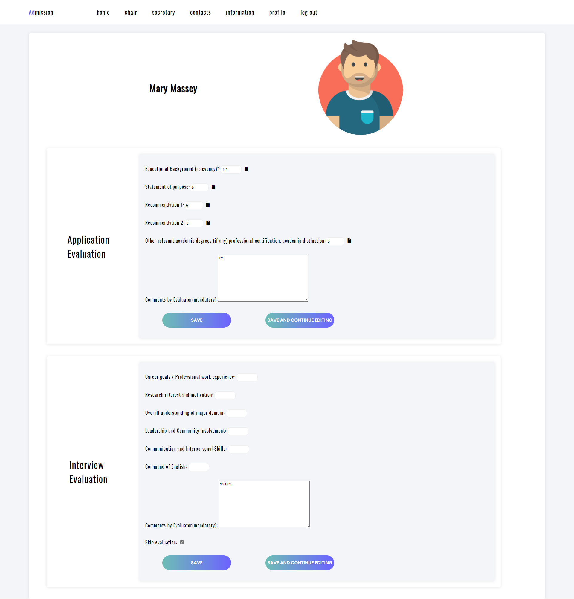

# Dynamic Portal Development using Python/Django Framework

This Project is aimed to develop a web platform to improve the admission process for Masters and Ph.D. degrees. 

Admissions portal is based on the python Django framework 

## Setup guide

To run application docker is needed to be installed.

First run can be initiated using command: 
```
docker-compose up  --build
```
To turn down: 
```
docker-compose down
```
Erase and turn down: 
```
docker-compose down -v
```
To turn on: 
```
docker-compose up
```

## Admissions workflow

In order to demonstrate the main principle of the web portal the workflow
diagram was developed. The overall workflow of the web portal is represented in
Figure 3.1. This diagram demonstrates how the process is conducted on the web
portal and shows all the people and instances, which are involved into admission
process using the developed web-portal.

<br/>


<p style="text-align: center;">Figure 3.1: Diagram of the web portal workflow</p>

### As is demonstrated, the workflow of the web portal looks like:
1. The applicants submit their documents to the Admission Portal of the university.
       - Firstly, the candidates submit the required documents to the admission
          department. These documents will be used on the web portal by all the
          staff members involved in the admission process.
       - If the application contains all the documents required and satisfies all the requirements set to apply for the particular program, the Admission
          Department collects them in order to use them in the next steps.
       - Otherwise, the Admission Department discards the application.


2. The applicants submit their documents to the Admission Portal of the university.
       - The Admission Department creates an application profile on the web
          platform and uploads the documents. The documents, which are uploaded to the candidate profile will be utilized by the other members,
          who are involved in the process.
       - The profile creation is done using the provided form on the web portal.


3. Members of the Admission Committee access the applications and evaluate
    them.
       - Firstly, members of the Committee evaluate the submitted documents
          contained in the application.
       - Secondly, members of the Committee conduct the interview with the
          applicant and evaluate the interview results.
       - Both parts of the evaluations can be done and submitted separately
          through the provided forms on the web portal.


4. School secretary accesses the evaluated application, checks it, and either approves or disapproves the evaluation.
       - If everything in evaluation is correct and follows all the required rules,
          the secretary approves it.
       - If there is something wrong with the evaluation, the secretary disapproves it.
       - In the case of the disapproving evaluation form, the secretary should
          indicate the reason as a comment on the following evaluation and send
          it back to the admission committee member for re-evaluation.


5. Chair of the Admission Committee accesses the list of evaluated and ap    proved candidates.
       - Chair of the admission committee sets the score threshold and obtains
          the list of candidates, who meet the required score. This can be done
          using the interface, which is provided on the web portal on the chair’s
          page.


6. The steps 1-5 can be repeated up to three times each accounting for the one
    admission round conducted by the university.


7. After, the Chair in cooperation with the School Office composing a final list
    of candidates and discarding those who are remained on the waiting list, or
    who rejected the invitation.


### Web Portal Interface

This subsection contains all the information related to the pages of the admission
web portal. In total, the web portal has 10 web pages. These pages have different
accessibility and functionality, which is considered in detail in the following part
of the report.

**Login Page**

In order to access the admission web portal, the user needs to log in to the website
using the login page. The login page is shown in the Figure 3.9. Only the registered users can successfully access the web portal. The registration on the web


portal is managed by the administrator. There are several types of accounts: admin
(superuser status), admission department member, admission committee member,
school secretary, and chair of the admission committee. Superuser status, which
only the admin account possesses, allows the administrator to access all the pages
on the web portal, which is done to manage the correct functioning of the web
portal.
The login page consists of 4 main functional elements:

- The text field to type in user’s email.
- The text field to type in user’s password.
- The link, which helps user in case of forgetting user’s password.
- The button to log in to the web portal. If all the information provided is
    correct, the user will log in to the web portal. Otherwise, the user will be
    notified that something is incorrect and the user will not be logged in.


<p style="text-align: center;">Figure 3.9: Login Page</p>

**Main Page (Home Page)**

The page, which welcomes the users after the login, is the main or home page.
This page is looking different, depending on the type of the user. The main page
is shown in the Figure 3.10, Figure 3.11, Figure 3.12.
The main page consists of 4 main functional elements:


- The navigation panel with the links, which help users to access other pages
    of the web portal.
- The filtering interface, which helps users to filter and sort the candidates,
    basing on their status or type of applied program. Moreover, the user can
    search the candidate by first or last name.
- The event panel, which shows the user the latest events (candidates deletions,
    additions, or changes), that happened.
- The list of candidates, which contains the links for: the evaluations of the
    candidates (for Admission Committee members and chair), the approvals of
    the candidates
       **-** The evaluations of the candidates (for Admission Committee members
          and chair);
       **-** The approvals of the candidates (for School secretaries);
       **-** The candidates’ profiles with the documents (for Admission Department
          members).


<p style="text-align: center;">
Figure 3.10: Main Page (Admission Commitee (Chair and Members))
</p>


<p style="text-align: center;">
Figure 3.11: Main Page (School Secretary)
</p>


<p style="text-align: center;">
Figure 3.12: Main Page (Admission Department)
</p>


**Add Candidate Page**

If the user has privileges of the Admission Department member, the user can access
the Add Candidate page from the main page, which provides the form to create a
candidate profile by filling the text fields with the candidate’s data and uploading
the candidate’s documents. The Add Candidate page is shown in Figure 3.13.
The Add Candidate page consists of 6 main functional form elements, which
are grouped in one form:

- The first group for the candidate’s general information.
    **-** The text field to type in the candidate’s name.
    **-** The text field to type in candidate’s surname.
    **-** The text field to indicate, to which degree the candidate is applying.
- The second group for the candidate’s test information.
    **-** The field to indicate candidate’s IELTS score.
    **-** The field to indicate candidate’s TOEFL score.
    **-** The field to indicate candidate’s GRE or GMAT score.
- The third group for uploading the candidate’s documents, which are required
    for the application. The documents can be re-uploaded in case of a mistake
    or an error.
       **-** The field to upload candidate’s diploma.
       **-** The field to upload candidate’s IELTS certificate.
       **-** The field to upload candidate’s TOEFL certificate.
       **-** The field to upload candidate’s GRE or GMAT certificate.
       **-** The field to upload candidate’s statement of purpose.
       **-** The field to upload candidate’s CV.
       **-** The field to upload candidate’s recommendation letter (first).
       **-** The field to upload candidate’s recommendation letter (second).
- The fourth group for indicating the information about the candidate’s edu    cation.
       **-** The field to indicate candidate’s education program start date.
       **-** The field to indicate candidate’s education program end date.
       **-** The field to indicate candidate’s education program graduation date.
       **-** The field to indicate candidate’s education program degree.


**-** The field to indicate candidate’s education program field.
**-** The field to indicate candidate’s education program institution.
**-** The field to indicate candidate’s education program GPA.
- The fifth group for indicating the information about the candidate’s education is optional and used to indicate additional education, obtained by the
candidate.
**-** The field to indicate candidate’s education program start date.
**-** The field to indicate candidate’s education program end date.
**-** The field to indicate candidate’s education program graduation date.
**-** The field to indicate candidate’s education program degree.
**-** The field to indicate candidate’s education program field.
**-** The field to indicate candidate’s education program institution.
**-** The field to indicate candidate’s education program GPA.
- The last element is the submit button, which sends the filled form to the
server. If some fields are missing or are filled incorrectly, the form will not
be submitted, and the user will be notified.


<p style="text-align: center;">
Figure 3.13: Add Candidate Page
</p>

**Change Candidate Page**

If the user has privileges of the Admission Department member, the user can access
the Add Candidate page from the list of candidates on the main page by clicking
on any desired candidate, which provides the form to observe, change, or delete
a candidate profile, which was created by the Add Candidate form. The Add
Candidate page is shown in Figure 3.14.
To submit the changes made to the candidate’s profile, the "Submit" button at
the bottom of the page should be clicked.
To delete the candidate’s profile, the "Delete" button at the bottom of the page
should be clicked.


<p style="text-align: center;">
Figure 3.14: Add Candidate Page
</p>

**Evaluation Page**

If the user has privileges of the Admission Committee member, the user can access
the Evaulate Candidate page from the main page, which provides the form to


evaluate a candidate by filling the fields with evaluation marks, accordig to the
admission rules. The Evaluate Candidate page is shown in Figure 3.15.
The Evaluation page consists of 2 main functional elements:

- The form for application evaluation.
    **-** This form contains fields, which need to be filled with the evaluation
       marks. These marks are made by the evaluator by checking the docu       ments of the candidate and the educational background of the candi       date.
    **-** The fields, which are required to be filled are:
       * Candidate’s educational background mark.
       * Candidate’s statement of purpose mark.
       * Candidate’s recommendation letter (first and second) mark.
       * Candidate’s relevant degrees or certificates mark.
       * The evaluator is required to make some comments about the evalu          ation to successfully submit it.
    **-** The documents of the candidate can be downloaded by the user by click       ing on the document icon next to the relevant form field.
    **-** The educational background can be viewed by the user by clicking on
       the first name of the filed in the form (Education Background). The
       action will result in the opening of the modal window with the relat4ed
       information. This modal window is shown in Figure 3.16.
    **-** The "Save" button submits the form to the server. If some fields are
       missing or are filled incorrectly, the form will not be submitted, and the
       user will be notified.
    **-** The "Save and continue editing" button allows user to save the filled
       information, but not to send it to the server yet.
- The form for interview evaluation.
    **-** This form contains fields, which need to be filled with the evaluation
       marks. These marks are made by the evaluator by conducting the inter       view woth the candidate and evalutationg the interview results.
    **-** The documents of the candidate can be downloaded by the user by click       ing on the document icon next to the relevant form field.
    **-** The "Save" button submits the form to the server. If some fields are
       missing or are filled incorrectly, the form will not be submitted, and the
       user will be notified.
    **-** The "Save and continue editing" button allows user to save the filled
       information, but not to send it to the server yet.



<p style="text-align: center;">
Figure 3.15: Evaluation Page
</p>


<p style="text-align: center;">
Figure 3.16: Educational Background Modal Window
</p>

**Approval Page**

If the user has privileges of the School secretary, the user can access the Approval
page from the main page, which provides the form to approve an evaluation of
a candidate, which is made by the Admission Committee member, by filling the
fields with relevant information and approve or disapprove the evaluation, according to the admission rules. The Approval page is shown in Figure 3.17.
The Approval page consists of 5 main functional elements:

- The form to fill correctly the GPA and school rating of the candidate. More    over, the school secretary can access the educational background modal win    dow, which is similar to the window shown before in Figure 3.16.
- The application evaluation information. The excel file with all the scores can
    be downloaded by clicking the excel file icon next to the form header.
- The interview evaluation information. The excel file with all the scores can
    be downloaded by clicking the excel file icon next to the form header.
- The file to indicate whether the evaluation is correct or incorrect.
- The button to submit approval or disapproval to the server.


<p style="text-align: center;">
Figure 3.17: Approval Page
</p>

**Chair Page**

If the user has privileges of the Admission Committee chair, the user can access
the Chair page from the navigation panel, which provides the interface to manage
the list of the candidates in the current admission round. The Chair page is shown
in Figure 3.18.
The Chair page consists of 3 main functional elements:

- The statistics container shows the statistics of the current admission rounds.
    The available statistics are the total number of candidates, the number of
    candidates, whose evaluation is in process, and the number of candidates,
    whose evaluation is completed.
- The interface, which allows the chair to set the threshold value for the score.
    This results in constructing the list of candidates, who are eligible for ad    mission. This list is shown on the secretary page, which is discussed later
    on.


- The button to view the list of candidates, which contains the candidates’
    name, surname, and score. As the button is clicked, the list opens in the
    modal window, which is shown in Figure 3.19


<p style="text-align: center;">
Figure 3.18: Chair Page
</p>


<p style="text-align: center;">
Figure 3.19: Candidate List Modal Window
</p>

**Secretary Page**

If the user has privileges of the School secretary, the user can access the Secretary
page from the navigation panel, which provides the interface to move the candidates between 3 lists, which are recommended for admission, waiting list, and
rejected. The Secretary page is shown in Figure 3.20.
The Approval page consists of 2 main functional elements:

- The filtering panel to filer the list of students, which are related to different
    admission rounds.
- The tree list of the candidates with the candidates’ cards. These cards have
    several features:
       **-** The cards contain general information about the candidate, such as the
          candidate’s name, surname, and score.
       **-** The user can download the excel file with the application or interview
          evaluation scores by clicking relevant links on the cards.
       **-** The user can move the candidates between the list by clicking on the
          "Promote" and "Reject" buttons. The "Promote" button will move the
          candidate to the "Recommended for admission" list from the "Waiting
          list"; the "Reject" button will move the candidate to the "Rejected" list
          from the "Recommended for admission" list.
       **-** All the candidates in the admission rounds are placed in the "Wating
          list" initially.
       **-** If the chair of the Admission Committee sets the threshold, the candi          dates, who possess a score that is higher than the threshold, will be
          moved automatically to the "Recommended for admission" list.


<p style="text-align: center;">
Figure 3.20: Approval Page
</p>

**Contacts Page**

Every user can acces the Contacts page from the navigation panel. This page contains the contact information of all people, whcih are involved into the admission
process. The Contacts page is shown in Figure 3.21.
The Contacts page contains 4 list of contacts, which are:

- Contacts of the Admission Commitee chair.
- Contacts of the Admission Department members.
- Contacts of the Admission Commitee members.
- Contacts of the School secretaries.

The user can get the contact information of any other desired user by clicking
on the user contact card. If the user clicks on the user contact card, the page
with the contact information opens, it is shown in Figure 3.22. This information
includes:


- User’s name.
- User’s surname.
- User’s photo.
- User’s school.
- User’s department.
- User’s mobile number.
- User’s email.


<p style="text-align: center;">
Figure 3.21: Contacts Page
</p>


<p style="text-align: center;">
Figure 3.22: Contact Information
</p>

**Information Page**

Every user can access the Information page from the navigation panel. This page
contains the information, which is related to the admission process, for example,
general rules for the admission or the specific correction of the rules related to the
specific academic year. The Information page is shown in Figure 3.23.
All the information needed can be added by the administrator through the
administrator panel.


<p style="text-align: center;">
Figure 3.23: Information Page
</p>

**Profile Page**

Every user can access the own Profile page from the navigation panel. This page
contains the general information of the user, such as:

- User’s name.
- User’s surname.
- User’s photo.
- User’s school.
- User’s department.
- User’s mobile number.
- User’s email.

The Profile page provides the interface to change the user’s password. It consists of 3 text fields, which are needed to be filled with:

- User’s current password.
- User’s new password.
- User’s new password for confirmation.

Moreover, there are guidelines for the user’s password, which need to be considered. If the guidelines will be ignored, the passwrod will not be changed.
In the Profile page user also can see the login history in user’s account.
The Profile page is shown in Figure 3.24.


<p style="text-align: center;">
Figure 3.24: Information Page
</p>

**Log Out**

The user can log out by clicking the "Log Out" link on the navigation panel. If the
log-out process will be successfully completed, the user will be redirected to the
Login Page.


#### 3.1.5 Project Structure

The structure of the application is represented in the figure below. An application
divided into multiple distinct applications, which are:

- admission_periods_app
- admissions_portal
- api_app
- auth_app
- candidates_app
- evaluations_app
- help_information_app
- mainapp
- render_excel_app

The project structure is demonstrated in Figure 3.40.
The admissions_portal is the main application that is responsible for the coordination of other apps and containing sensitive settings that are required for the
functioning of the whole program, in particular, it contains a primary routing table for the URL routing and application logger configuration, a list of connected
applications, including 3rd party apps, database settings that are required for the
successful connection to the database, etc.
Admission_periods_app is responsible for changing the admission periods and
years, the composition of related staff lists, and relating candidates and evaluations to appropriate periods. In general, it is a mechanism that is configuring new
admission periods with all the necessary peripheral actions.
The api_app is responsible for the API-based manipulations that are widely
used in the REST architecture. Simply speaking, it allows making manipulations
without an actual user interface, by simply sending information to the server. In
our application, we use this feature to implement asynchronous manipulations
between the client and server-side
Authentication and authorization are held by the auth_app, which is responsible for the user creation and further interactions. As it is stated before, we have
several types of users, with different privileges. The superuser is an administrator
account, it is granted with all privileges that exist, admission department users
can only add new instances of candidates and edit them if necessary. Admission
committee members are only able to edit evaluations that are already created by the system, the chair of the admission committee, in addition to editing evaluations, responsible for setting the threshold for the candidates that are involved in
the round admission, thus can partially edit the admission round attributes. Secretaries can review the evaluations that are done by the committee members and add
information to the evaluations that are straightforward and don’t require any experience in a related field, such as GPA and related experience. Additionally, they
can approve or disapprove evaluation upon a need, review and edit composed lists
of candidates for the current admission year and download approved evaluations
in the excel format for further proceed.
All the candidate-related activities are held inside the candidate_app, including
database manipulations, file storage, and accessing logic and rendering pages related to candidate addition to the system and edition of the candidate information
by the admission department users.
Evaluation-related activities are isolated inside the evaluation_app. It ensures
proper information storage, the relation of the primary evaluation table in the
database into interview and application evaluations, related manipulations with
the evaluation, automation of several activities related to the evaluation of the candidates, and rendering of the evaluation editing page that is used by the admission
committee members as well as committee chair.
The logic related to the help information page is held inside the help_information_app.
It mainly focuses on rendering the help information page and storing the help information inside the database
Rendering evaluations to the excel format is held inside the render_excel_app.
This application has two primary functions, first is rendering an individual evaluation and returning it upon the request and second is a bulk rendering of all the
evaluations related to the particular candidate to excel and returning it in form of
a zip archive, it worth mentioning that interview and application evaluations are
rendering separately in two separate excel files, to make a clear distinction between
these two types of the evaluations.
Finally, mainapp is responsible for gathering all the applications together, by
taking the responsibility of URL routing of every application except admissions_portal,
rendering special views related to particular roles, such as chair page view and secretary page view and common to every user type dashboard and holding utility
functions that are used across every application.


<p style="text-align: center;">
Figure 3.40: Project Structure
</p>

Additionally, the project folder has logs and static folders. While the purpose
of the logs folder seems obvious, a static folder stores static files needed for the
functioning of the whole applications, like CSS files, javascript scripts, excel templates, and images that are being utilized during the rendering of the pages. Other
files inside the project folder constitute for the functioning of either Django framework or git, except dev_requirements.txt and db.sqlite3. File dev_requirements.txt
is used to assign dependencies that the current project relies on and db.sqlite3 is
a development database file, needed only for development purposes and excluded
in the final setup of the application.

#### 3.1.6 Project Diagram and Description

Figure 3.41 is a type of UML diagram adapted for Django project needs, storing
information about the database setup and showing the relationships between different tables, where dots represent x-to-many relationships and arrows represent
inheritance, thus, line with a dot in one of the ends means one-to-many relationship and line with dots at each of the ends represents many-to-many relationship.
This diagram can be utilized to describe the logic of the application, by exposing
dependencies and relationships of different tables with each other.


Starting from the CreateandUpdateRoutine table, which is simply information
about the time when the particular instance has been created and updated, thus, to
avoid duplicate code in every custom model in the application, almost every model
besides 3rd party applications is inheriting from that one. This is done to follow
the DRY(don’t repeat yourself) principle, stating that to improve code readability
and ease further maintenance, programmers should avoid duplicating to reduce
the overall complexity of the application and increase readability in general.
Talking about user instances, they are inherited from the Django built-in AbstractBaseUser, which describes the basic user behavior within the Django environment. Every time a user attempts to log in or out, the system makes a record to
the database in the LogEntry table to track user activity and unsuccessful attempts
to access accounts. Once user created, or during the creation procedure, he can
be assigned to the staff list of Admission Year instance, to make the user able to
participate in multiple admissions years, the staff list model and user model have a
many-to-many relationship with each other, meaning that every staff list can have
multiple users related to it and every user can be assigned to the multiple staff
lists, thus taking part in different admission years.
Further moving to the AdmissionYearModel and dependent AdmissionRoundModel table. Once a new admission year is created, the system creates a new
admission round, student list instance of type ”waiting list” and staff list instances
and relates them to this admission year instance. The creation of admission round
instances, in turn, triggers the creation of two additional instances of student list
of types “accepted students” and “rejected students”, which are initially empty,
but once the admission round’s threshold value changes, all the students involved
in the current admission period will be reassigned to the proper list based on the
total score value calculated from evaluations. At this stage, we came to adding new
candidates to the system. Once a new candidate instance is created, it is automatically assigned to the current admission year’s waiting list and triggers the creation
of evaluation instances for each admission committee member in the current staff
list, therefore, before adding candidates to the system, it is essential to compose
the final version of staff related to the committee privileges. Additionally, the system creates candidates to test and education instances, to isolate the logic of this to
models. Upon the creation of an evaluation instance system automatically creates
related interview and application evaluations with the one-to-one relationships.
Aside from described models, the system has an Information model, that is
responsible for storing help information and frequently asked questions. Session
and Abstract session models are Django’s built-in models to track all of the sessions
that are being held by the system.


<p style="text-align: center;">
Figure 3.41: Project Diagram
</p>
